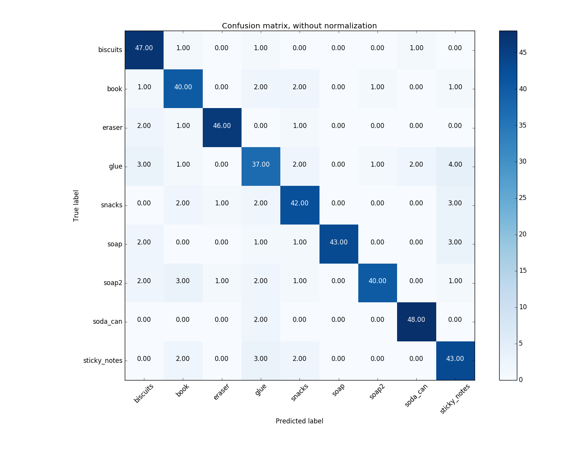
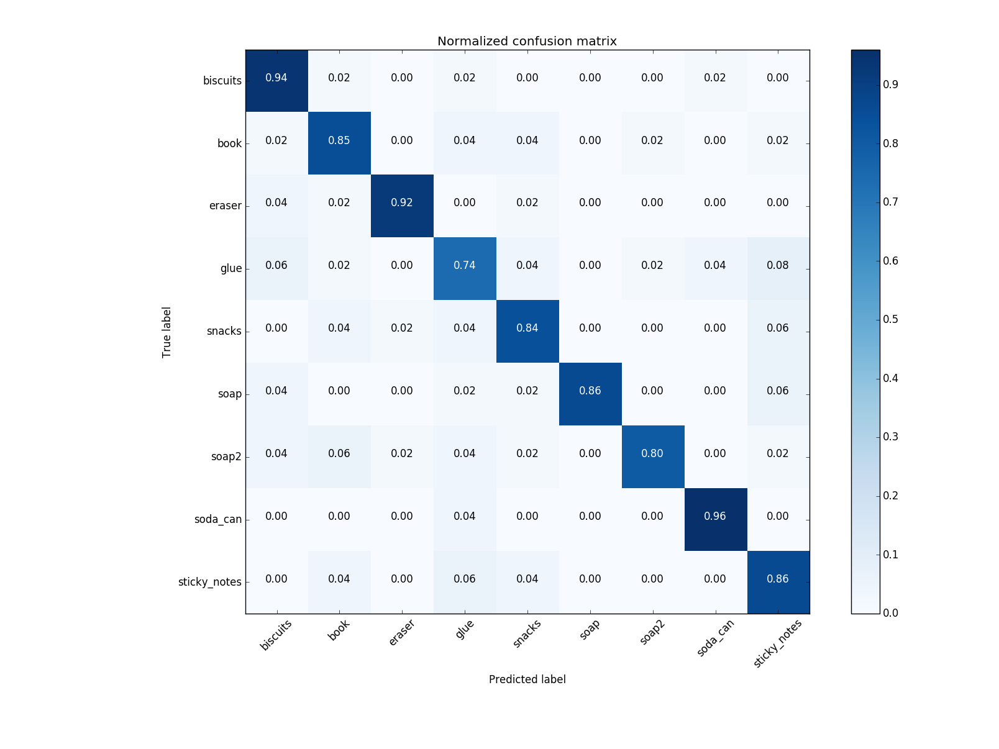
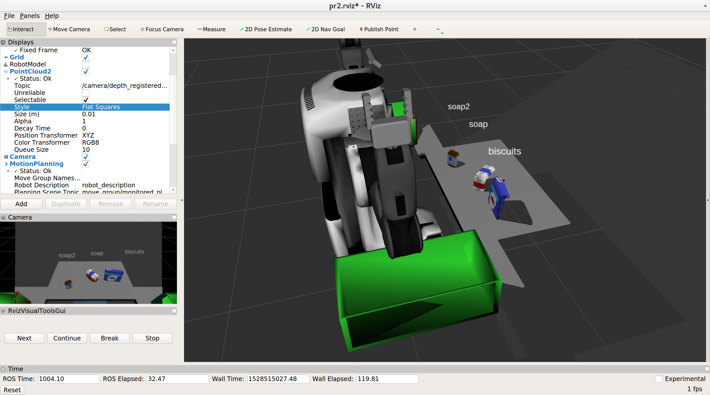
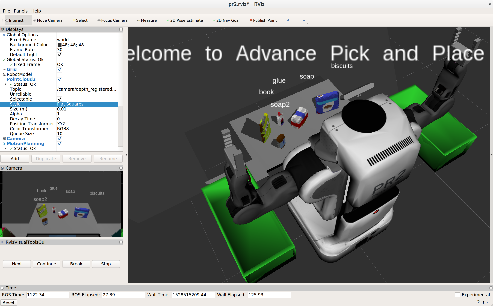
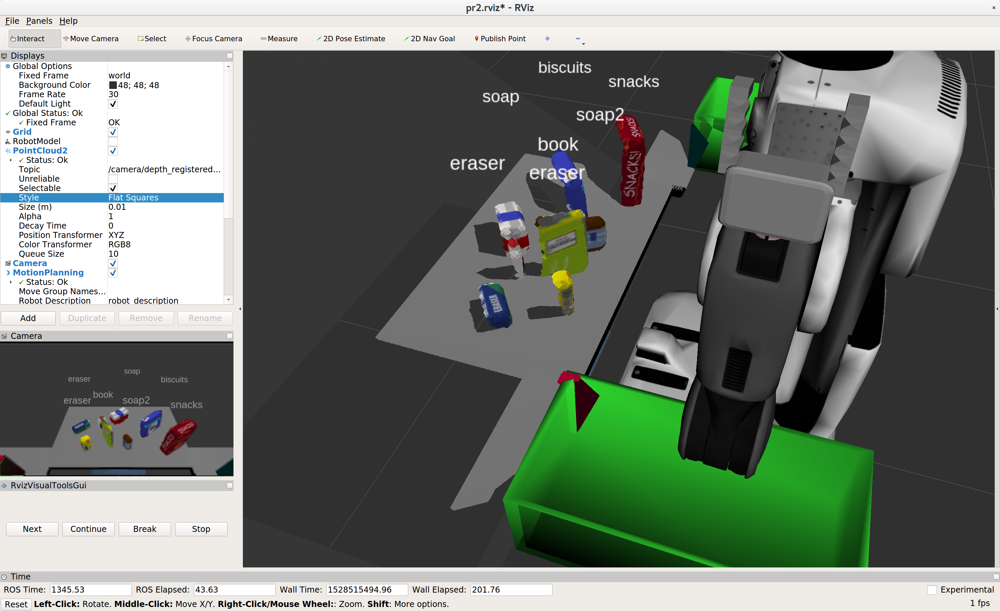

## Project: Perception Pick & Place


yaml Files : [yaml](yaml)   
My Code : [rec.py](pr2_robot/scripts/rec.py)  
Training Set : [training_set.sav](training_set.sav)    
Model : [model.sav](model.sav)    


### Building Pipline for Perception :

1. Voxel Grid : Downsampl the PCL Data 
2. Remove noise :
	
	```python
	#Statistical Outlier Removal Filter
		outlier_filter = cloud_filtered.make_statistical_outlier_filter()
		# Set the number of neighboring points to analyze for any given point
		outlier_filter.set_mean_k(20)
		# Set threshold scale factor
		x = 0.1
		# Any point with a mean distance larger than global (mean distance+x*std_dev) will be considered outlier
		outlier_filter.set_std_dev_mul_thresh(x)
		# Finally call the filter function for magic
		cloud_filtered = outlier_filter.filter()
	```
3. Apply PassThrough Filter :  
on the Z axis and Y axis to remove the junk Data and have only the region of interest :

	```python
	passthrough = cloud_filtered.make_passthrough_filter()
		passthrough.set_filter_field_name('z')
		axis_min = 0.6
		axis_max = 1.1
		passthrough.set_filter_limits(axis_min, axis_max)
		cloud_filtered = passthrough.filter()
		#for y too we have wide not useable area 
		passthroughY = cloud_filtered.make_passthrough_filter()
		passthroughY.set_filter_field_name('y')
		axis_min = -0.4
		axis_max = 0.4
		passthroughY.set_filter_limits(axis_min, axis_max)
		cloud_filtered = passthroughY.filter()
	```

4. Plane Segmentation :
to Remove the Table and keep just the Objects by identifying the table as Plane :

	```python
	seg = cloud_filtered.make_segmenter()
		seg.set_model_type(pcl.SACMODEL_PLANE)
		seg.set_method_type(pcl.SAC_RANSAC)
		max_distance = 0.01
		seg.set_distance_threshold(max_distance)
		inliers, coefficients = seg.segment()
		#Extract inliers and outliers
		extracted_inliers = cloud_filtered.extract(inliers, negative=False)
		extracted_outliers = cloud_filtered.extract(inliers, negative=True)
	```

5. Clustering :
first of all we make a white mask of our cloud to make it easier for the search tree to search within a tree that has no colors value to compare and calculate the distance to its neighbors

	```python
	white_cloud = XYZRGB_to_XYZ (extracted_outliers)
		tree = white_cloud.make_kdtree()
		
		#Create a cluster extraction object
		ec = white_cloud.make_EuclideanClusterExtraction()
		# Set tolerances for distance threshold 
		# as well as minimum and maximum cluster size (in points)
		ec.set_ClusterTolerance(0.03)
		ec.set_MinClusterSize(100)
		ec.set_MaxClusterSize(3000)
		# Search the k-d tree for clusters
		ec.set_SearchMethod(tree)
		# Extract indices for each of the discovered clusters
		cluster_indices = ec.Extract()
	```  
now we have cluster_indices (lists of listes of white points in the cloud then we loop over them all and we add the corresponding colored points to list 

	```python
			cluster_color = get_color_list(len(cluster_indices))
				color_cluster_point_list = []
			
				for j, indices in enumerate(cluster_indices):
				    for i, indice in enumerate(indices):
					color_cluster_point_list.append([white_cloud[indice][0],
					                                white_cloud[indice][1],
					                                white_cloud[indice][2],
					                                 rgb_to_float(cluster_color[j])])
			
				#Create new cloud containing all clusters, each with unique color
				cluster_cloud = pcl.PointCloud_PointXYZRGB()
				cluster_cloud.from_list(color_cluster_point_list)
	```  
6. Classification: 
loop through each detected cluster one at a time and compute the color and normal histograms usuing HSV instead of RGB and make a prediction

	```python
		detected_objects_labels = []
			detected_objects = []
		        # Grab the points for the cluster
			for index, pts_list in enumerate(cluster_indices):
				# Grab the points for the cluster from the extracted outliers (cloud_objects)
				pcl_cluster = extracted_outliers.extract(pts_list)
				
				#convert the cluster from pcl to ROS using helper function
				ros_cluster = pcl_to_ros(pcl_cluster)
				# Extract histogram features
				chists = compute_color_histograms(ros_cluster , using_hsv=True)
				normals = get_normals(ros_cluster)
		          	nhists = compute_normal_histograms(normals)
		            	feature = np.concatenate((chists, nhists))
				# Make the prediction, retrieve the label for the result
				# and add it to detected_objects_labels list
				prediction = clf.predict(scaler.transform(feature.reshape(1,-1)))
				label = encoder.inverse_transform(prediction)[0]
				detected_objects_labels.append(label)
		
				# Publish a label into RViz
				label_pos = list(white_cloud[pts_list[0]])
				label_pos[2] += .4
				object_markers_pub.publish(make_label(label,label_pos, index))
		
				# Add the detected object to the list of detected objects.
				do = DetectedObject()
				do.label = label
				do.cloud = ros_cluster
				detected_objects.append(do)
	```


### YAML and pr2_mover() :
now we have objects list from our Perception Pipline we compare it with the objects that already exist 

```pyton
object_list_param = rospy.get_param('/object_list')
	dropboxs = rospy.get_param('dropbox')
```
now we loop over every object and dertmine to which group it belongs and we write YAML File 

```python
for counter in range(0,len(object_list_param)):
		OBJECT_NAME.data = object_list_param[counter]['name']
		found = False

        # Get the PointCloud for a given object and obtain it's centroid
		for detected in object_list:

			if (OBJECT_NAME.data == detected.label):

				points_arr = ros_to_pcl(detected.cloud).to_array()
				centroids = (np.mean(points_arr,axis=0)[:3])        
				found = True

		if (found):
			PICK_POSE.position.x = float(centroids[0])
			PICK_POSE.position.y = float(centroids[1])
			PICK_POSE.position.z = float(centroids[2])

			for dropbox in dropboxs:
				if object_list_param[counter]['group'] == dropbox['group']:
					WHICH_ARM.data = dropbox['name']
					PLACE_POSE.position.x = dropbox['position'][0]
					PLACE_POSE.position.y = dropbox['position'][1]
					PLACE_POSE.position.z = dropbox['position'][2]
			# Create a list of dictionaries (made with make_yaml_dict()) for later output to yaml format

			yaml_dict = make_yaml_dict(SCENE_NUM,WHICH_ARM,OBJECT_NAME,PICK_POSE,PLACE_POSE)

			output_yaml.append(yaml_dict)


		# Wait for 'pick_place_routine' service to come up

			rospy.wait_for_service('pick_place_routine')
```

### Train SVM :
using linear Kernel and HSV instead of RGB to compute Color Histograms i could train the SVM with total 450 Features and get the below result : 
 

### Object recognition :
after loading the saved traind Model : [model.sav](model.sav) 
the result was in the first scene :   
3 / 3   

  

in the second :   
5/5  

  

in the third however :   
6/8  

